# AWS DevOps CI/CD Pipeline (GitHub → CodeBuild → CodeDeploy → EC2)

## Project Overview
This project implements an end-to-end **AWS CI/CD workflow** that builds a Java web application (WAR) and deploys it to an **EC2 instance running Apache Tomcat**.  
The goal was to automate builds and deployments using AWS native services while keeping GitHub as the single source of truth.

---

## Architecture
**Flow:** GitHub → CodeBuild → CodeDeploy → EC2 (Tomcat)  
**Supporting:** CodeArtifact (dependencies), S3 (artifacts), CloudFormation (IaC)

---

## What I Built

### 1) EC2 setup + Remote SSH workflow
- Provisioned an EC2 instance and connected using SSH (VS Code Remote SSH).
- Fixed PEM key permissions for SSH access.

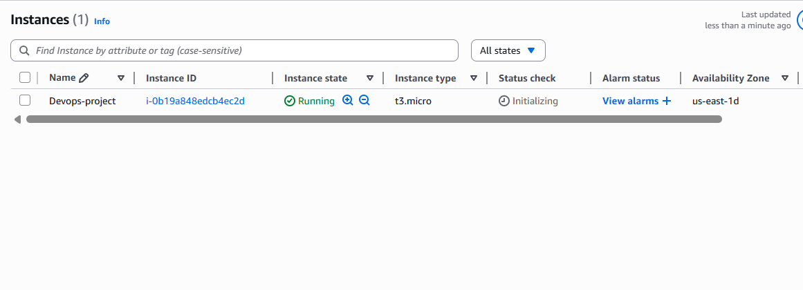
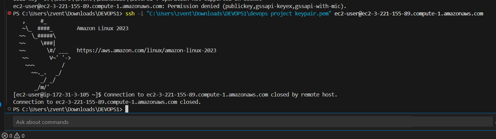

---

### 2) GitHub repository as the source of truth
- Created a GitHub repo and initialized a local git repository.
- Committed and pushed changes (with commit history evidence).

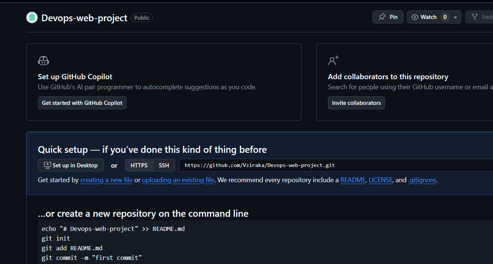
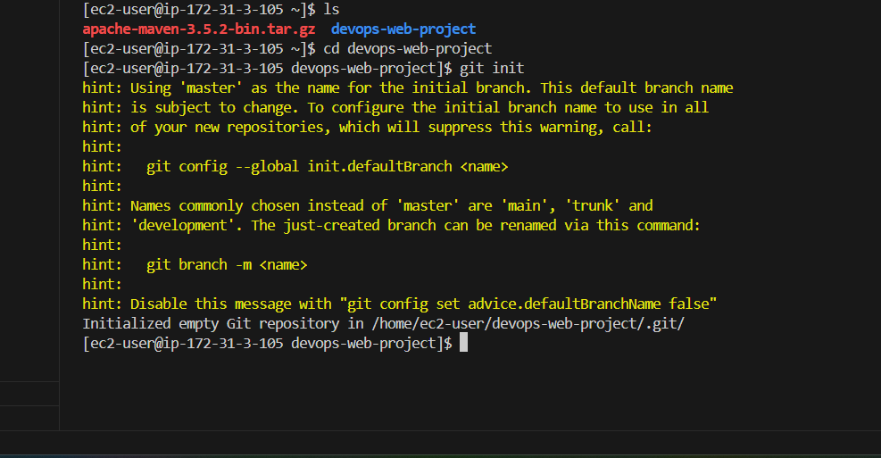
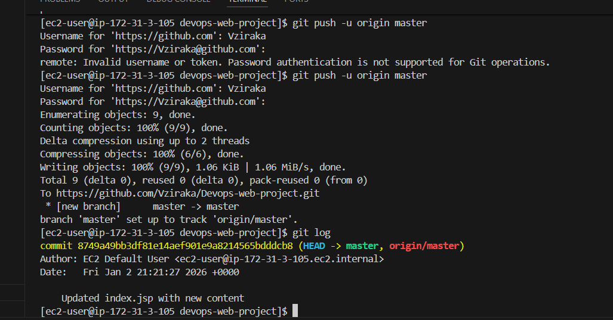
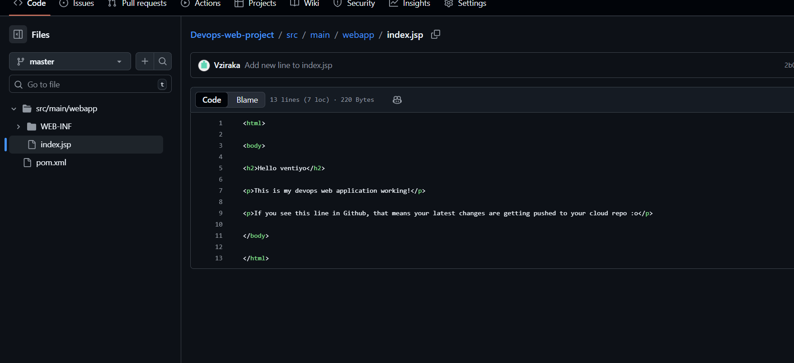

---

### 3) Secure dependencies with AWS CodeArtifact
- Connected Maven to CodeArtifact using `settings.xml`.
- Verified dependency resolution during builds.

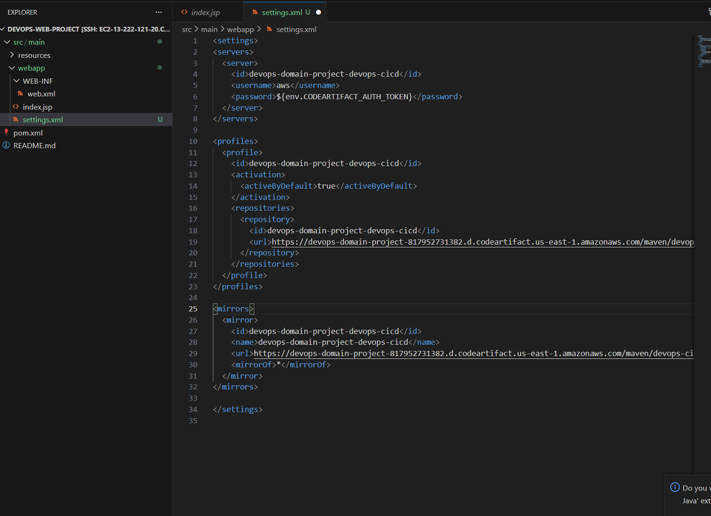
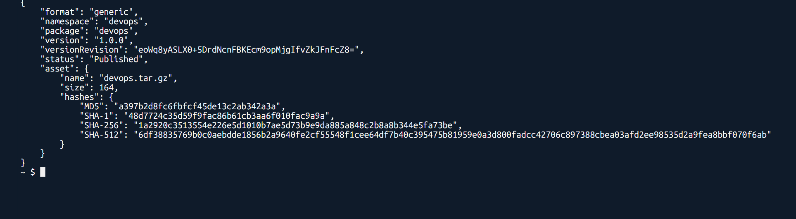

---

### 4) Continuous Integration with AWS CodeBuild
- Configured `buildspec.yml` to build and package the WAR artifact.
- Confirmed successful build output.

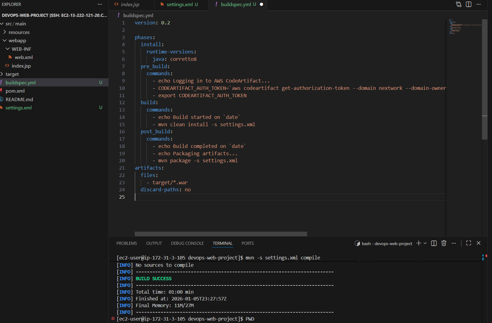
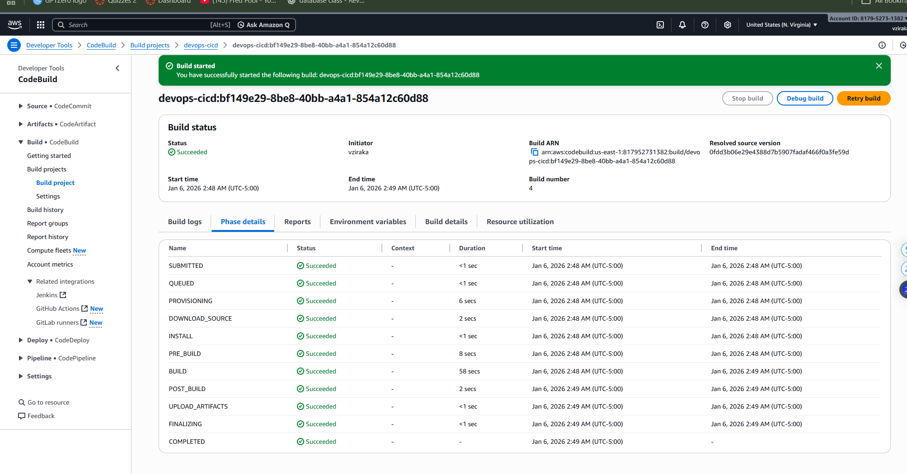

---

### 5) Infrastructure as Code with CloudFormation
- Created a CloudFormation stack to validate the environment can be recreated.

---

### 6) Automated deployment with AWS CodeDeploy
- Created CodeDeploy application + deployment group targeting EC2 via tags.
- Deployed WAR to Tomcat and verified application success.

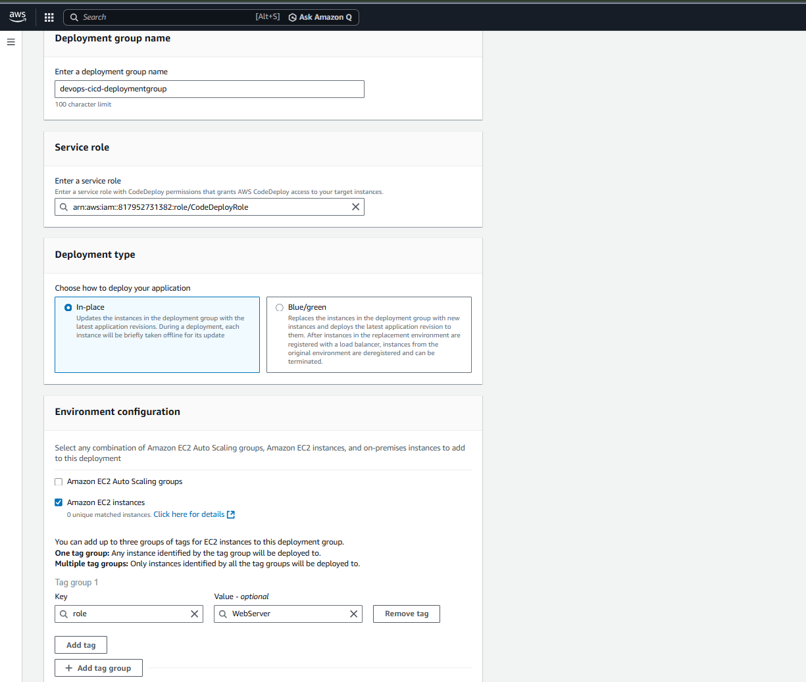
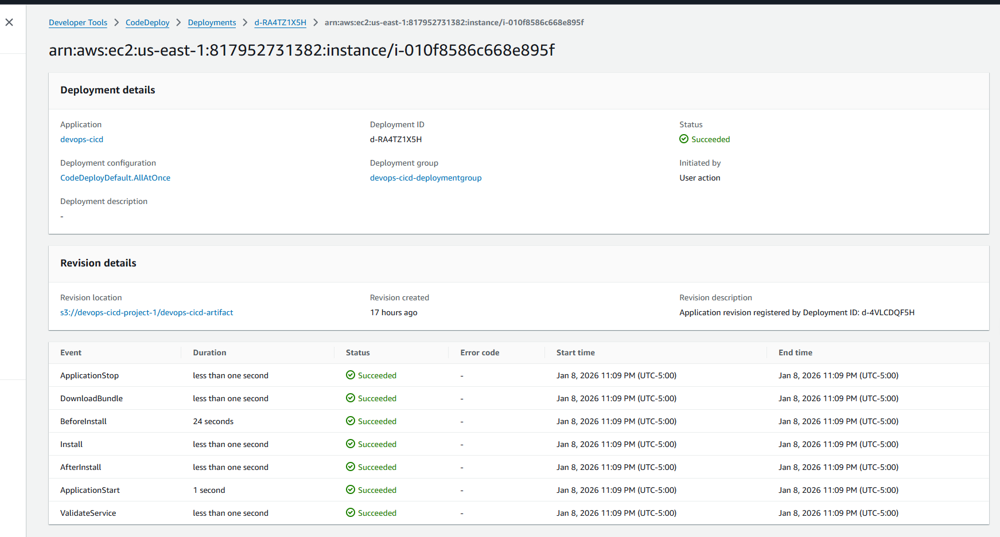
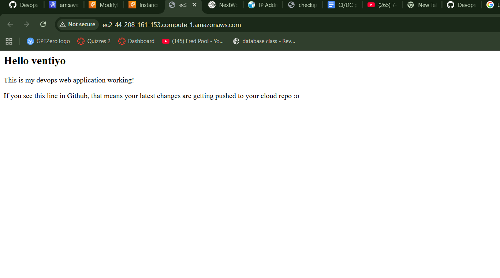

---

## Repo Contents (high level)
- `buildspec.yml` for CodeBuild
- `appspec.yml` + `scripts/` for CodeDeploy lifecycle hooks
- Java web app packaged as a WAR via Maven

---

## Key Takeaways
- **CI/CD automation:** pushes trigger builds and deployments through AWS services.
- **Repeatability:** CloudFormation enables rebuilding the environment from scratch.
- **Separation of responsibilities:** GitHub stores source code; EC2 only runs the deployed artifact.

---

## Author
**Ensizziyo (Ventiyo) Ziraka**
